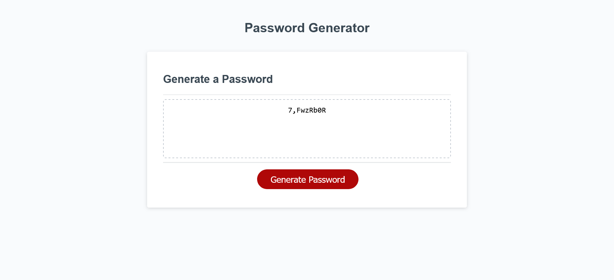

# password-generator

## Description

This project has been made to allow empolyee to generate a random password based on criteria they have selected. The password can must include at least one type of characters: lower or upper cases, numbers, or special characters. The empoyee can choose lenght of the password between 8 and 128 chatacters.

## Installation

N/A

## Usage

Application should be used to generate a random password. After clicking "Generate Password" button, user will  be prompted with chosices of lengh of password and types of chatacters they wish to use. After answering the questions, password will be written to the page.

## Credits

N/A

## License

Please refer to the LICENSE in the repo

## Badges

N/A

## Features

N/A

## How to Contribute

N/A

## Link

https://klaudia102.github.io/password-generator/